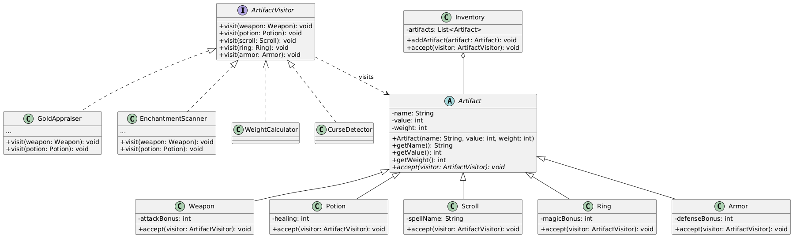
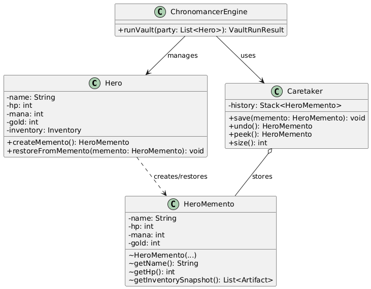

# Homework 9 — Chronomancer's Vault: Visitor + Memento

## Overview

In this assignment you will implement two behavioral design patterns inside a time-warped RPG vault:

- **Visitor** appraises heterogeneous artifacts without `instanceof` chains
- **Memento** saves and restores a hero's state through time crystals

The two patterns are intentionally independent. Visitor handles *what you do with many artifact types*; Memento handles *how you rewind one hero's mutable state*.

---

## Patterns Covered

| Pattern | Role in this system |
|---------|---------------------|
| **Visitor** | Walks a mixed inventory of `Weapon`, `Potion`, `Scroll`, `Ring`, and `Armor` through double dispatch. New reports are added by creating new visitors, not by editing artifact classes. |
| **Memento** | Snapshots a hero's mutable state so the Chronomancer's Vault can rewind HP, mana, gold, and inventory after a trap or failed appraisal. |

---

## What Is Provided

| File | Description |
|------|-------------|
| `src/com/narxoz/rpg/artifact/ArtifactVisitor.java` | Visitor interface with one overload per artifact type |
| `src/com/narxoz/rpg/artifact/Artifact.java` | Abstract artifact base class |
| `src/com/narxoz/rpg/artifact/Weapon.java` | Weapon skeleton |
| `src/com/narxoz/rpg/artifact/Potion.java` | Potion skeleton |
| `src/com/narxoz/rpg/artifact/Scroll.java` | Scroll skeleton |
| `src/com/narxoz/rpg/artifact/Ring.java` | Ring skeleton |
| `src/com/narxoz/rpg/artifact/Armor.java` | Armor skeleton |
| `src/com/narxoz/rpg/artifact/Inventory.java` | Inventory traversal helper |
| `src/com/narxoz/rpg/combatant/Hero.java` | Hero skeleton with memento hooks |
| `src/com/narxoz/rpg/combatant/HeroMemento.java` | Immutable hero snapshot with package-private accessors |
| `src/com/narxoz/rpg/memento/Caretaker.java` | Memento caretaker shell |
| `src/com/narxoz/rpg/vault/VaultRunResult.java` | Vault run summary data class |
| `src/com/narxoz/rpg/vault/ChronomancerEngine.java` | Vault orchestration shell |
| `src/com/narxoz/rpg/Main.java` | Entry point skeleton |

Everything else — concrete visitors, memento wiring, and the vault demo flow — is yours to build.

---

## Quick Start

```bash
# Compile
javac -d out $(find src -name "*.java")

# Run
java -cp out com.narxoz.rpg.Main
```

See `QUICKSTART.md` for IDE setup and detailed instructions.

---

## Read Next

- `ASSIGNMENT.md` — full requirements, anti-pattern penalties, and grading rubric
- `STUDENT_CHECKLIST.md` — phase-by-phase progress tracker
- `FAQ.md` — answers to common questions about Visitor and Memento

---

## Connection to Previous Homeworks

| Homework | Patterns | Theme |
|----------|----------|-------|
| `homework-rpg-7` | Decorator + Facade | Early RPG pattern pairing |
| `homework-rpg-8` | State + Template Method | The Haunted Tower |
| `homework-rpg-9` | Visitor + Memento | Chronomancer's Vault |

The series keeps mixing pattern pairs, but each assignment still asks you to implement the patterns independently and demonstrate them clearly in `Main.java`.

### Visitor


### Memento


## Ссылка на код
https://github.com/zarina-kulm/homework-rpg-9